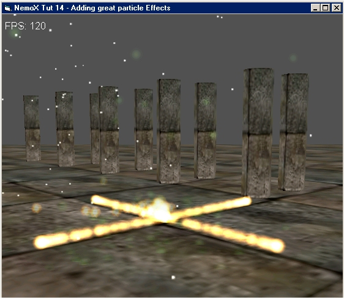



## Laser Ray Particle Effects

### Description

This code shows how to make infinite Particle Effects (Explosion,fire,snow,laser,smoke....) thanks to NemoX 3D engine.

The use of the particle Engine is very easy.

Note that The code uses DirectX 8.1.

Leave feedbacks.
 
### More Info
 

             |
---                |---
**Submitted On**   |2003-06-03 12:18:12
**By**             |[polaris](https://github.com/Planet-Source-Code/PSCIndex/blob/master/ByAuthor/polaris.md)
**Level**          |Advanced
**User Rating**    |5.0 (25 globes from 5 users)
**Compatibility**  |VB 4\.0 \(32\-bit\), VB 5\.0, VB 6\.0
**Category**       |[DirectX](https://github.com/Planet-Source-Code/PSCIndex/blob/master/ByCategory/directx__1-44.md)
**World**          |[Visual Basic](https://github.com/Planet-Source-Code/PSCIndex/blob/master/ByWorld/visual-basic.md)
**Archive File**   |[Laser\_Ray\_1606066262003\.zip](https://github.com/Planet-Source-Code/polaris-laser-ray-particle-effects__1-46450/archive/master.zip)

